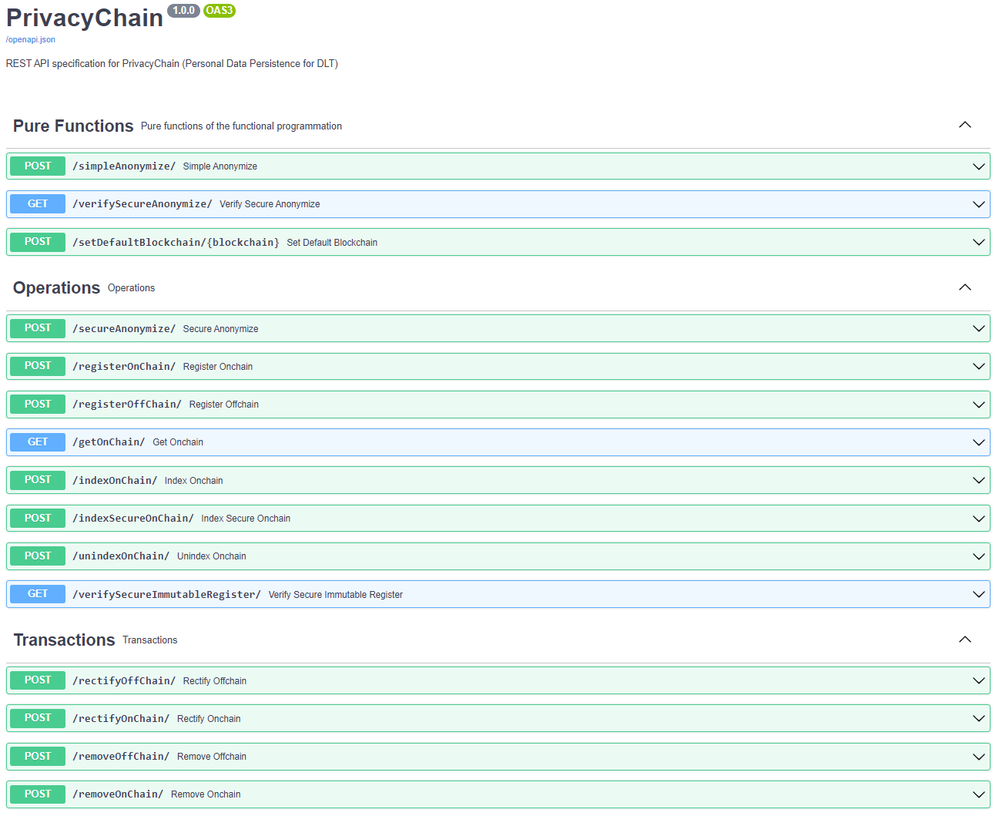
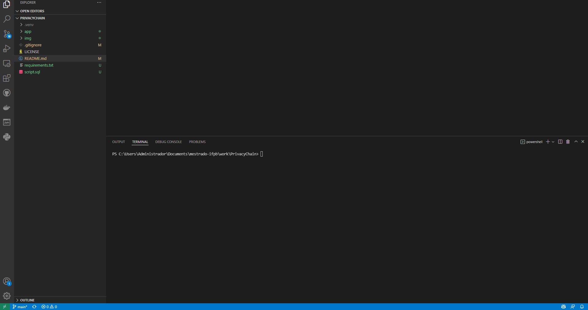

# PrivacyChain

## Introduction
A framework for personal data persistence in DLT applications for compliance to RTBF and right to rectification of the LGPD - Brazilian law for personal data protection.  

 

---  

## Motivation
This project is part of the Dissertation of the Master at PPGTI-IFPB.


In applications based on DLT (Distributed Ledger Technology), or blockchain as they are more commonly called, that process personal data, the characteristic of immutability intrinsic to this technology can be an obstacle for the data subject exercises the rights to be forgotten and to rectification for compliance with the LGPD – Brazilian Law for the Protection of Personal Data.  

An investigation was conducted. The investigation showed the suitability of using two techniques combined: (1) off-chain storage and (2) cryptographic commitment.  

A framework PrivacyChain was built with two techniques cited above. PrivacyChain features are made available through an API. Each resource of PrivacyChain is implemented as an API's endpoint.  

---

## Good for
Compliance with LGPD's rights: RTBF (Right To Be Forgotten) and Right to rectification.  

---

## Built with
- [FAST API (v0.68.0)](https://fastapi.tiangolo.com/)
- [Ganache (v2.5.4)](https://trufflesuite.com/ganache)
- [PostgreSQL (v13.3)](https://www.postgresql.org/download/)
- [Web3.py (v5.23.0)](https://web3py.readthedocs.io/en/stable/#)

---

## Instructions for installation
1. Download code from GitHub: [https://github.com/abmorte/privacychain](https://github.com/abmorte/PrivacyChain)
2. Create a virtual environment. Example name: .venv 
```
  python -m venv .venv
```
3. Activate this environment: Examples commands below and between ' '
```
  Example in Linux: 'source .venv/bin/activate'
  Example in Windows: '.venv/Scripts/Activate'
```
4. Install libraries in it from requirements.txt:
```
    pip install -r requirements.txt
``` 
5. Download and install PostgreSQL database, vide [https://www.postgresql.org/download/](https://www.postgresql.org/download/).
6. Create the database (for control and tracking of personal data) with script.sql.
7. Install Ganache vide [https://trufflesuite.com/ganache/](https://trufflesuite.com/ganache/)
  ---
  **NOTE**

    For Ganache's installation on Linux:

 *  download ganache v2.5.4 from [link](https://github.com/trufflesuite/ganache-ui/releases/download/v2.5.4/ganache-2.5.4-linux-x86_64.AppImage) 
 *  execute chmod 777 ganache-2.5.4-linux-x86_64.AppImage
 *  execute ./Ganache-2.1.0.AppImage
  ---
8. Execute command:
 ```
    uvicorn app.main:app --reload
 ``` 
9. Access localhost:8000/docs for swagger UI interface, or localhost:8000/redoc for redoc interface.
10. Demonstration
   
 


## Usage

-  Data preparation
   * List - according to the application's business context - the personal data you want to store in the blockchain.

   * Select data that atomically identifies the owner of the personal data. This will be the *locator* key, to be used on the logging endpoints in the blockchain.

- Adequate application to trigger PrivacyChain services
  * It´s necessary to adequate the application that will use PrivacyChain´s services. Below is the howto for the major´s endpoints.

### Register on blockchain
#### Use endpoint /indexOnChain/ for simple anonymization or /indexSecureOnChain for secure anonymization.


```python
# Pseudocode for insert secure on-chain

def insert_health_record(locator: str) -> bool:
  """
  INSERT in application \n 
  """
  try:
    # locator = patiente´s document
    locator = 72815157071

    insert_health_record(locator)

    # call to PrivacyChain endpoint for secure blockchain registration.
    # Note payload includes locator key
    indexSecureOnChain(payload)
  except:
    print("An error has occurred.")
  else: 
    print("Registration successful.")

  return True
```

```python
# Sample client code for consumption of indexSecureOnChain endpoint

import requests

url = "http://localhost:8000/indexSecureOnChain/"

payload = {
    "to_wallet": "0x1eca7eD6322B410219Ef953634442AF33aB05BA3",
    "from_wallet": "0x190e97032E45A1c3E1D7E2B1460b62098A5419ab",
    "content": "{cpf:72815157071, exam:HIV, datetime:2021-09-14T19:50:47.108814, result:POS}",
    "locator": "72815157071",
    "datetime": "2021-09-25T10:58:00.000000",
    "salt": "e3719002-8c09-4c8f-8da3-9f5ce34c2d76"
}
headers = {"Content-Type": "application/json"}

response = requests.request("POST", url, json=payload, headers=headers)

print(response.text)
```

#### Test endpoint /indexSecureOnChain/ ([Insomnia](https://insomnia.rest/))
 

---
### Right To Be Forgotten
#### Use endpoint /removeOnChain/


```python
# Pseudocode for Remove on-chain

def delete_health_record(locator: str) -> bool:
  """
  DELETE in application \n 
  """
  try:
    # locator = patiente´s document
    locator = 72815157071

    # medical record deletion in the application database
    delete_health_record(locator)

    # call to PrivacyChain endpoint for blockchain record deletion.
    # Note payload includes locator key
    removeOnChain(payload)
  except:
     print("An error has occurred")
  else:
     print("Record deleted successfully.")
  return True
```

```python
# Sample client code for consumption of removeOnchain endpoint

import requests

url = "http://localhost:8000/removeOnChain/"

payload = {
    "locator": "72815157071",
    "datetime": "2021-09-14T19:50:47.108814"
}
headers = {"Content-Type": "application/json"}

response = requests.request("POST", url, json=payload, headers=headers)

print(response.text)
```

#### Test endpoint /removeOnChain ([Insomnia](https://insomnia.rest/))


---
### Right to Rectification
#### Use endpoint /rectifyOnChain/

```python
# Pseudocode for Rectify on-chain

def update_health_record(locator: str) -> bool:
  """
  UPDATE in application \n 
  """
  try:
    # locator = patiente´s document
    locator = 72815157071

    # medical record rectification in the application database
    update_health_record(locator)

    # call to PrivacyChain endpoint to rectify blockchain record.
    # Note payload includes locator key
    rectifyOnChain(payload)
  except:
     print("An error has occurred")
  else:
     print("Record successfully rectified.")
  return True
```


```python

# Sample client code for consumption of rectifyOnchain endpoint

import requests

url = "http://localhost:8000/rectifyOnChain/"

payload = {
    "content": "{cpf:72815157071, exam:HIV, datetime:2021-09-14T19:50:47.108814, result:POS}",
    "salt": "e3719002-8c09-4c8f-8da3-9f5ce34c2d76",
    "to_wallet": "0x1eca7eD6322B410219Ef953634442AF33aB05BA3",
    "from_wallet": "0x190e97032E45A1c3E1D7E2B1460b62098A5419ab",
    "locator": "72815157071",
    "datetime": ""
}
headers = {"Content-Type": "application/json"}

response = requests.request("POST", url, json=payload, headers=headers)

print(response.text)
```

#### Test endpoint /rectifyOnChain ([Insomnia](https://insomnia.rest/))


---
## License
This project is licensed under the terms of the MIT license.